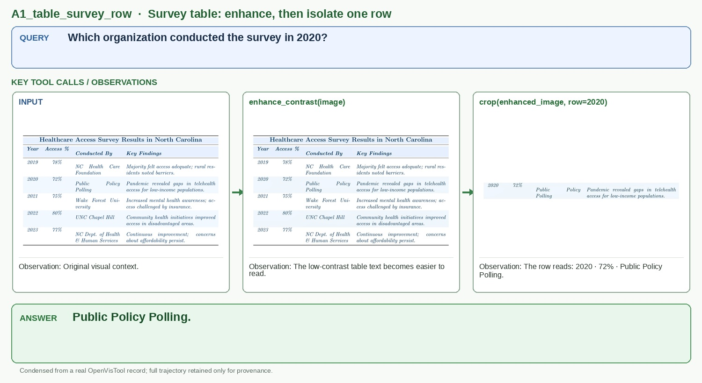

# A1_table_survey_row

## Query

Which organization conducted the survey in 2020?

## Key tool calls / observations

1. `enhance_contrast(image)`
   - Observation: The low-contrast table text becomes easier to read.
2. `crop(enhanced_image, row=2020)`
   - Observation: The row reads: 2020 · 72% · Public Policy Polling.

## Answer

**Public Policy Polling.**

## Figure-ready assets

- Panel 1, Input table: `panel_1_input_table.png`
- Panel 2, Contrast enhancement: `panel_2_contrast_enhancement.jpg`
- Panel 3, Cropped evidence: `panel_3_cropped_evidence.jpg`

## Provenance (for audit only)

- Final OpenVisTool source: `dataset/OpenVisTool/Table_5k.jsonl` line 732 (1-based)
- Record SHA-256: `4cd9bfa508f2f3e7753bd73dc98f6eb493ac9ab07cfbcc91a6bf02c70f12ff9e`
- Full record: `record.jsonl` / `record.pretty.json`
- Original rollout: `source_session.jsonl`
- Full readable trajectory: `trajectory.md`
