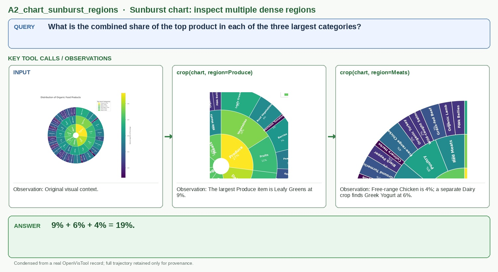

# A2_chart_sunburst_regions

## Query

What is the combined share of the top product in each of the three largest categories?

## Key tool calls / observations

1. `crop(chart, region=Produce)`
   - Observation: The largest Produce item is Leafy Greens at 9%.
2. `crop(chart, region=Meats)`
   - Observation: Free-range Chicken is 4%; a separate Dairy crop finds Greek Yogurt at 6%.

## Answer

**9% + 6% + 4% = 19%.**

## Figure-ready assets

- Panel 1, Sunburst input: `panel_1_sunburst_input.jpg`
- Panel 2, Crop: Produce: `panel_2_crop_produce.jpg`
- Panel 3, Crop: Meats: `panel_3_crop_meats.jpg`

## Provenance (for audit only)

- Final OpenVisTool source: `dataset/OpenVisTool/Chart_14k.jsonl` line 8420 (1-based)
- Record SHA-256: `5f4521924effae5a7d41da6feb8f6a74813eb3f85fa38a992b1c6689f6133967`
- Full record: `record.jsonl` / `record.pretty.json`
- Original rollout: `source_session.jsonl`
- Full readable trajectory: `trajectory.md`
