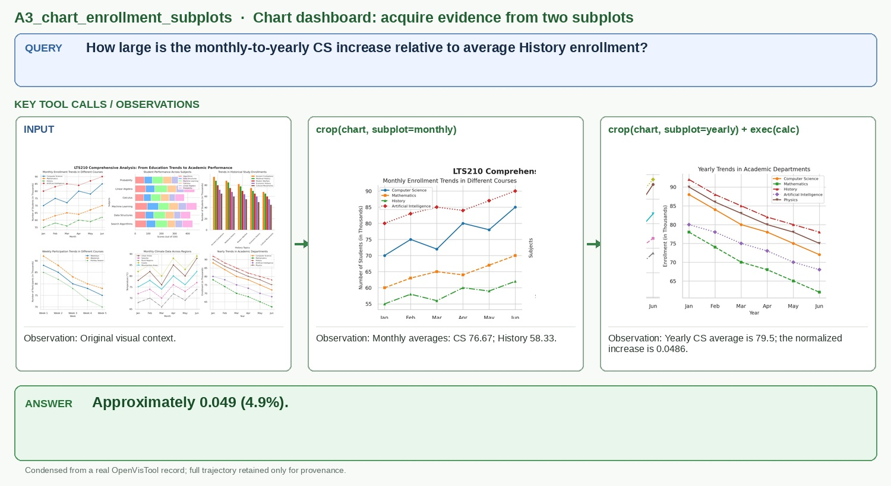

# A3_chart_enrollment_subplots

## Query

How large is the monthly-to-yearly CS increase relative to average History enrollment?

## Key tool calls / observations

1. `crop(chart, subplot=monthly)`
   - Observation: Monthly averages: CS 76.67; History 58.33.
2. `crop(chart, subplot=yearly) + exec(calc)`
   - Observation: Yearly CS average is 79.5; the normalized increase is 0.0486.

## Answer

**Approximately 0.049 (4.9%).**

## Figure-ready assets

- Panel 1, Multi-chart input: `panel_1_multi_chart_input.jpg`
- Panel 2, Monthly subplot: `panel_2_monthly_subplot.jpg`
- Panel 3, Yearly subplot: `panel_3_yearly_subplot.jpg`

## Provenance (for audit only)

- Final OpenVisTool source: `dataset/OpenVisTool/Chart_14k.jsonl` line 1889 (1-based)
- Record SHA-256: `41c3471d7fca9ed115472590c274c5ce72b479312f25ee1846ace32c7c5f7f6a`
- Full record: `record.jsonl` / `record.pretty.json`
- Original rollout: `source_session.jsonl`
- Full readable trajectory: `trajectory.md`
