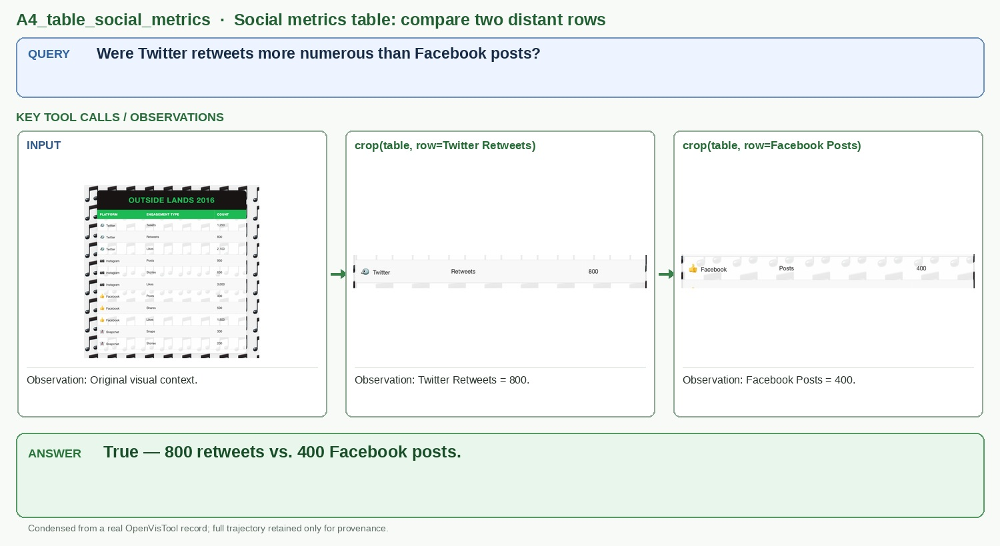

# A4_table_social_metrics

## Query

Were Twitter retweets more numerous than Facebook posts?

## Key tool calls / observations

1. `crop(table, row=Twitter Retweets)`
   - Observation: Twitter Retweets = 800.
2. `crop(table, row=Facebook Posts)`
   - Observation: Facebook Posts = 400.

## Answer

**True — 800 retweets vs. 400 Facebook posts.**

## Figure-ready assets

- Panel 1, Input table: `panel_1_input_table.png`
- Panel 2, Twitter row: `panel_2_twitter_row.jpg`
- Panel 3, Facebook row: `panel_3_facebook_row.jpg`

## Provenance (for audit only)

- Final OpenVisTool source: `dataset/OpenVisTool/Table_5k.jsonl` line 878 (1-based)
- Record SHA-256: `c99cc0c8c3d92bdc1458743ef17ed642d0219d21b9f07055ad5397e5c52813d8`
- Full record: `record.jsonl` / `record.pretty.json`
- Original rollout: `source_session.jsonl`
- Full readable trajectory: `trajectory.md`
