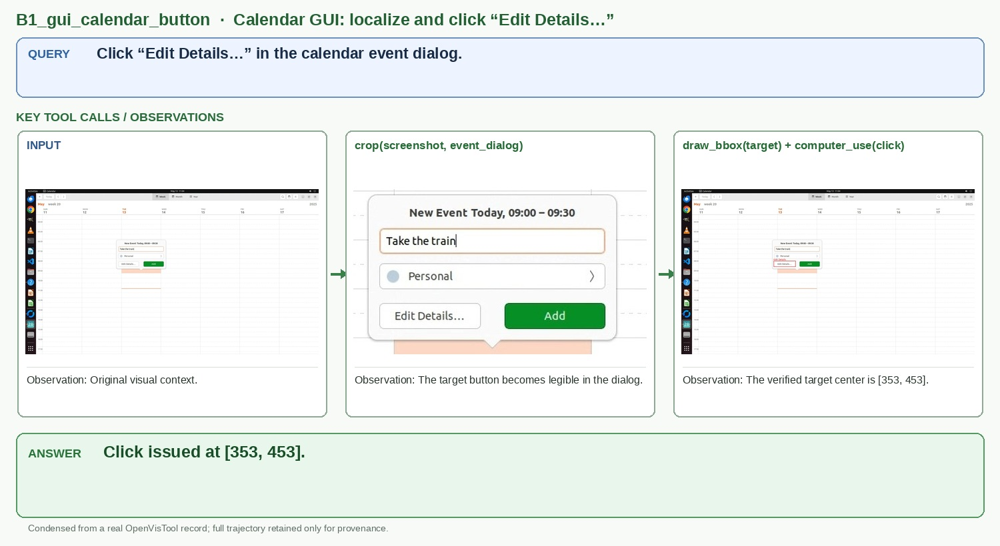

# B1_gui_calendar_button

## Query

Click “Edit Details…” in the calendar event dialog.

## Key tool calls / observations

1. `crop(screenshot, event_dialog)`
   - Observation: The target button becomes legible in the dialog.
2. `draw_bbox(target) + computer_use(click)`
   - Observation: The verified target center is [353, 453].

## Answer

**Click issued at [353, 453].**

## Figure-ready assets

- Panel 1, GUI input: `panel_1_gui_input.png`
- Panel 2, Target crop: `panel_2_target_crop.jpg`
- Panel 3, BBox verification: `panel_3_bbox_verification.jpg`

## Provenance (for audit only)

- Final OpenVisTool source: `dataset/OpenVisTool/GUI-Grounding_11k.jsonl` line 816 (1-based)
- Record SHA-256: `a0b3f1b98a5b170fc65a90d37690ef4d15bda9cc00d587f3ff3508230c50c813`
- Full record: `record.jsonl` / `record.pretty.json`
- Original rollout: `source_session.jsonl`
- Full readable trajectory: `trajectory.md`
