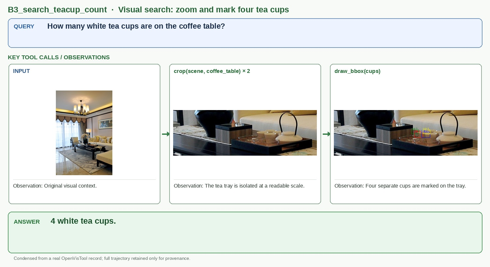

# B3_search_teacup_count

## Query

How many white tea cups are on the coffee table?

## Key tool calls / observations

1. `crop(scene, coffee_table) × 2`
   - Observation: The tea tray is isolated at a readable scale.
2. `draw_bbox(cups)`
   - Observation: Four separate cups are marked on the tray.

## Answer

**4 white tea cups.**

## Figure-ready assets

- Panel 1, Cluttered scene: `panel_1_cluttered_scene.jpg`
- Panel 2, Close crop: `panel_2_close_crop.jpg`
- Panel 3, Counted objects: `panel_3_counted_objects.jpg`

## Provenance (for audit only)

- Final OpenVisTool source: `dataset/OpenVisTool/VisualSearch_2k.jsonl` line 1035 (1-based)
- Record SHA-256: `46171a2eb43d993e996a6d4a6db29d645719f56f1dde45ad1ae0a935fe21ab1c`
- Full record: `record.jsonl` / `record.pretty.json`
- Original rollout: `source_session.jsonl`
- Full readable trajectory: `trajectory.md`
