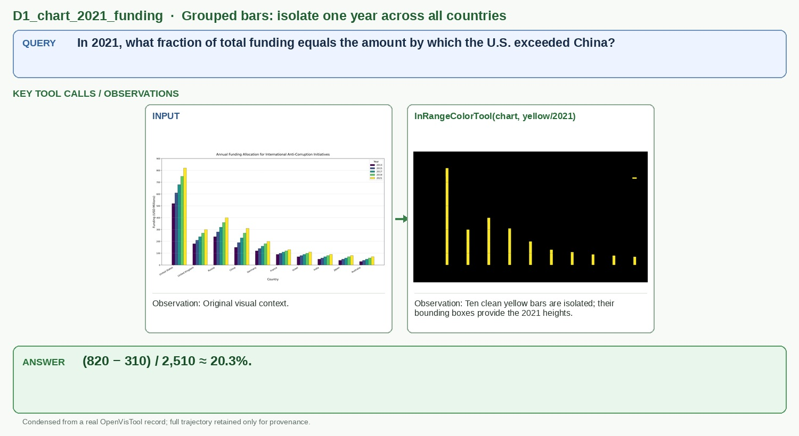

# D1_chart_2021_funding

## Query

In 2021, what fraction of total funding equals the amount by which the U.S. exceeded China?

## Key tool calls / observations

1. `InRangeColorTool(chart, yellow/2021)`
   - Observation: Ten clean yellow bars are isolated; their bounding boxes provide the 2021 heights.

## Answer

**(820 − 310) / 2,510 ≈ 20.3%.**

## Figure-ready assets

- Panel 1, Grouped-bar input: `panel_1_grouped_bar_input.jpg`
- Panel 2, 2021 series isolated: `panel_2_2021_series_isolated.jpg`

## Provenance (for audit only)

- Final OpenVisTool source: `dataset/OpenVisTool/Chart_14k.jsonl` line 10155 (1-based)
- Record SHA-256: `e186d085de269ba1ba9b5f5d1538fa729c09883c311a903d5f934fa5c47227c5`
- Full record: `record.jsonl` / `record.pretty.json`
- Original rollout: `source_session.jsonl`
- Full readable trajectory: `trajectory.md`
