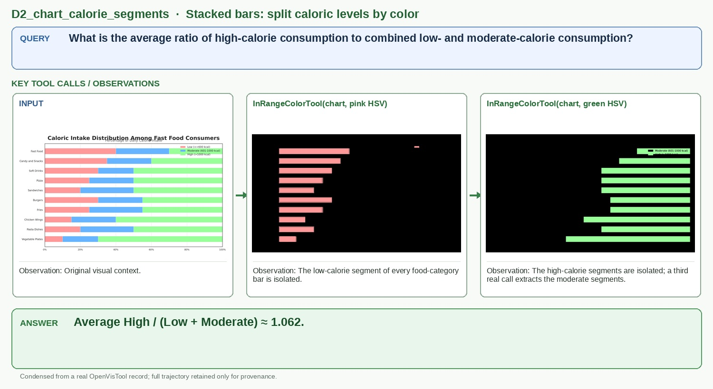

# D2_chart_calorie_segments

## Query

What is the average ratio of high-calorie consumption to combined low- and moderate-calorie consumption?

## Key tool calls / observations

1. `InRangeColorTool(chart, pink HSV)`
   - Observation: The low-calorie segment of every food-category bar is isolated.
2. `InRangeColorTool(chart, green HSV)`
   - Observation: The high-calorie segments are isolated; a third real call extracts the moderate segments.

## Answer

**Average High / (Low + Moderate) ≈ 1.062.**

## Figure-ready assets

- Panel 1, Stacked-bar input: `panel_1_stacked_bar_input.jpg`
- Panel 2, Low-calorie segments: `panel_2_low_calorie_segments.jpg`
- Panel 3, High-calorie segments: `panel_3_high_calorie_segments.jpg`

## Provenance (for audit only)

- Final OpenVisTool source: `dataset/OpenVisTool/Chart_14k.jsonl` line 10682 (1-based)
- Record SHA-256: `bbc22285265faeda9b58d835b84edf47ce8516db5140cb19e7feea868351b04d`
- Full record: `record.jsonl` / `record.pretty.json`
- Original rollout: `source_session.jsonl`
- Full readable trajectory: `trajectory.md`
