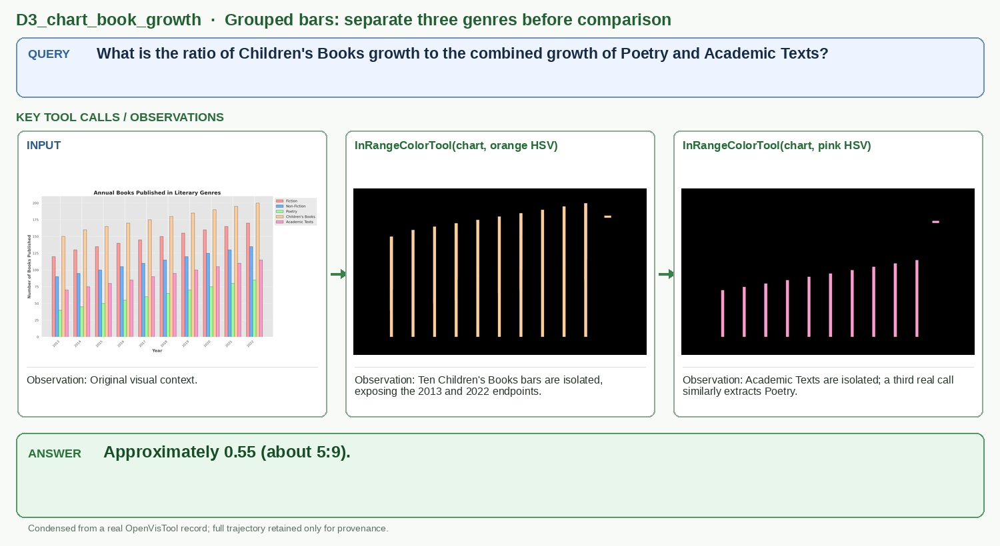

# D3_chart_book_growth

## Query

What is the ratio of Children's Books growth to the combined growth of Poetry and Academic Texts?

## Key tool calls / observations

1. `InRangeColorTool(chart, orange HSV)`
   - Observation: Ten Children's Books bars are isolated, exposing the 2013 and 2022 endpoints.
2. `InRangeColorTool(chart, pink HSV)`
   - Observation: Academic Texts are isolated; a third real call similarly extracts Poetry.

## Answer

**Approximately 0.55 (about 5:9).**

## Figure-ready assets

- Panel 1, Grouped-bar input: `panel_1_grouped_bar_input.jpg`
- Panel 2, Children's Books: `panel_2_children_s_books.jpg`
- Panel 3, Academic Texts: `panel_3_academic_texts.jpg`

## Provenance (for audit only)

- Final OpenVisTool source: `dataset/OpenVisTool/Chart_14k.jsonl` line 3712 (1-based)
- Record SHA-256: `584ccf9ff77a785b1ce606afd9ca28362635513a3574cf80f517534837ad12d1`
- Full record: `record.jsonl` / `record.pretty.json`
- Original rollout: `source_session.jsonl`
- Full readable trajectory: `trajectory.md`
