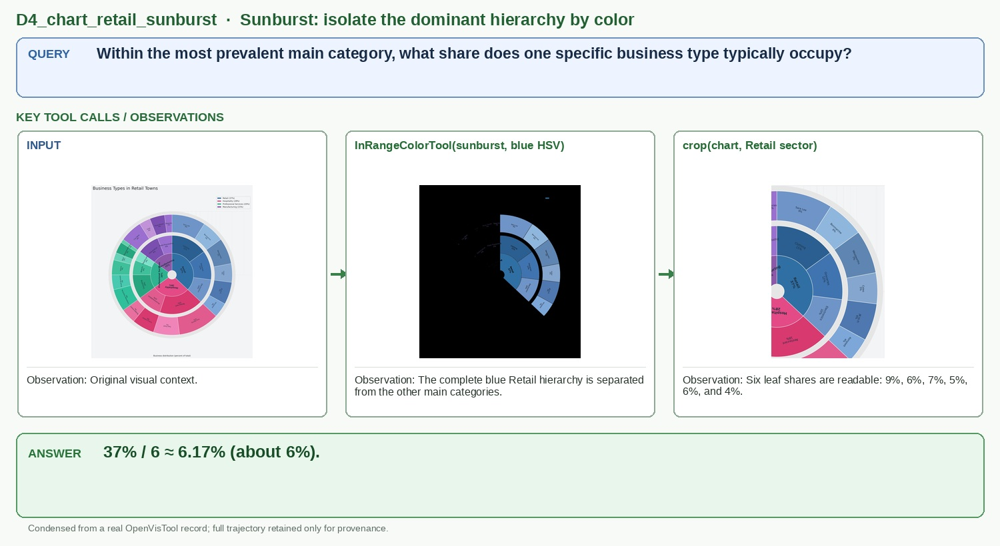

# D4_chart_retail_sunburst

## Query

Within the most prevalent main category, what share does one specific business type typically occupy?

## Key tool calls / observations

1. `InRangeColorTool(sunburst, blue HSV)`
   - Observation: The complete blue Retail hierarchy is separated from the other main categories.
2. `crop(chart, Retail sector)`
   - Observation: Six leaf shares are readable: 9%, 6%, 7%, 5%, 6%, and 4%.

## Answer

**37% / 6 ≈ 6.17% (about 6%).**

## Figure-ready assets

- Panel 1, Sunburst input: `panel_1_sunburst_input.jpg`
- Panel 2, Retail hierarchy isolated: `panel_2_retail_hierarchy_isolated.jpg`
- Panel 3, Retail crop: `panel_3_retail_crop.jpg`

## Provenance (for audit only)

- Final OpenVisTool source: `dataset/OpenVisTool/Chart_14k.jsonl` line 12016 (1-based)
- Record SHA-256: `49fa5b22e0762886617313a883598319e58edd5a28d8a42648c24502bb5a8fa2`
- Full record: `record.jsonl` / `record.pretty.json`
- Original rollout: `source_session.jsonl`
- Full readable trajectory: `trajectory.md`
