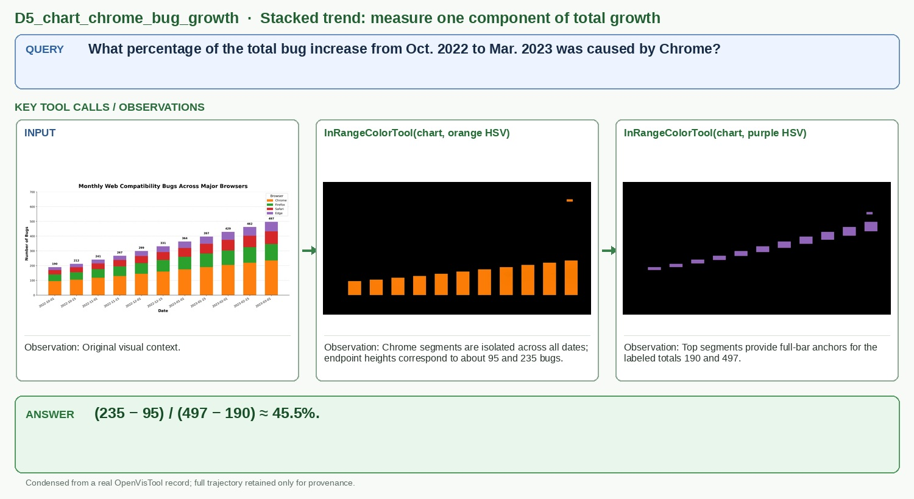

# D5_chart_chrome_bug_growth

## Query

What percentage of the total bug increase from Oct. 2022 to Mar. 2023 was caused by Chrome?

## Key tool calls / observations

1. `InRangeColorTool(chart, orange HSV)`
   - Observation: Chrome segments are isolated across all dates; endpoint heights correspond to about 95 and 235 bugs.
2. `InRangeColorTool(chart, purple HSV)`
   - Observation: Top segments provide full-bar anchors for the labeled totals 190 and 497.

## Answer

**(235 − 95) / (497 − 190) ≈ 45.5%.**

## Figure-ready assets

- Panel 1, Stacked-bar input: `panel_1_stacked_bar_input.jpg`
- Panel 2, Chrome segments: `panel_2_chrome_segments.jpg`
- Panel 3, Total-height anchors: `panel_3_total_height_anchors.jpg`

## Provenance (for audit only)

- Final OpenVisTool source: `dataset/OpenVisTool/Chart_14k.jsonl` line 12163 (1-based)
- Record SHA-256: `8f6f5b6b3e2f38bb995b02ceee1114c2f682160c9f6b18ba993cea3c6aea588c`
- Full record: `record.jsonl` / `record.pretty.json`
- Original rollout: `source_session.jsonl`
- Full readable trajectory: `trajectory.md`
